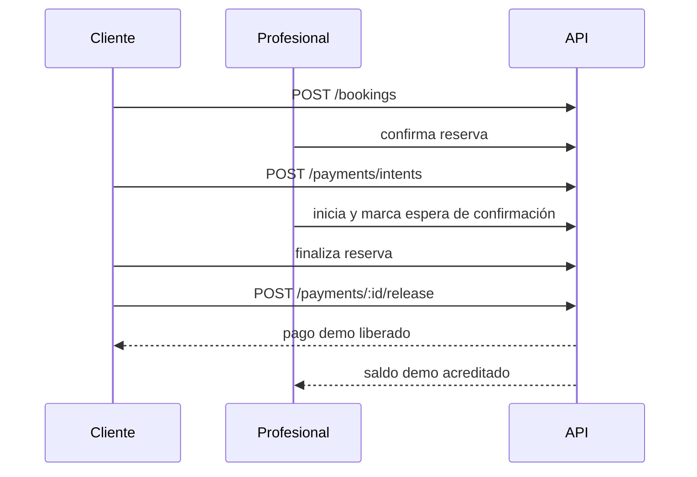

# Flujos críticos

## Reserva y pago demo

```mermaid
sequenceDiagram
  participant C as Cliente
  participant P as Profesional
  participant A as API
  C->>A: POST /bookings
  P->>A: confirma reserva
  C->>A: POST /payments/intents
  P->>A: inicia y marca espera de confirmación
  C->>A: finaliza reserva
  C->>A: POST /payments/:id/release
  A-->>C: pago demo liberado
  A-->>P: saldo demo acreditado
```

Las transiciones y sus precondiciones se documentan en [[04_DOMINIO/RESERVAS_Y_PAGOS]].
