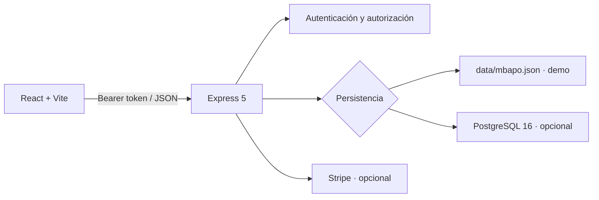

# Visión de arquitectura

## Límites

- La SPA guarda el token en `sessionStorage`; el servidor valida firma, expiración y `tokenVersion`.
- `requireAuth` carga cuenta, perfil y estado en `req.account`, `req.profile` y `req.db`.
- La API valida los payloads de negocio con Zod y devuelve errores JSON.
- En producción se sirven los archivos generados en `dist/`; en desarrollo Vite proxifica `/api`.
- La PWA usa un service worker para el shell y deja las rutas API fuera de caché.

## Restricción principal

La persistencia sigue el patrón cargar-estado-completo, mutar en memoria y guardar todo. Es adecuado para demo, no para alto volumen. Ver [[05_BASE_DATOS/PERSISTENCIA]].
